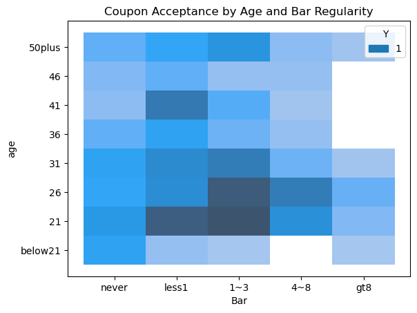
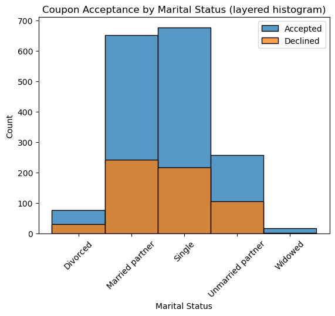
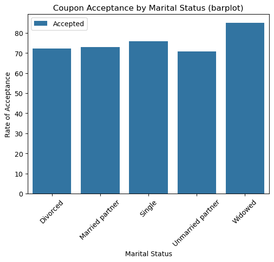
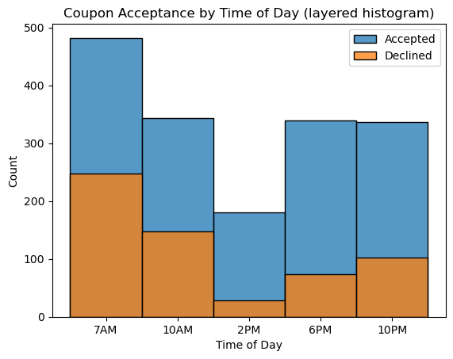
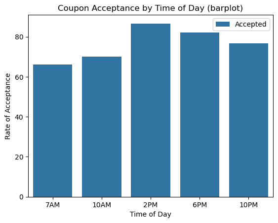

# BH-AI2604-PA5.1
PA 5.1 Will the Customer Accept the Coupon?

[Jupyter Notebook](./prompt.ipynb)

## Introduction

We will investigate 3 problems
1. Identify data issues and decide how to address them
2. Identify the participant characteristics that make Bar Coupon acceptance most likely
3. Identify the participant characteristics that make To Go Coupon acceptance most likely

## 1. Investigate the dataset for missing or problematic data.

Looking at the coupon data, the following issues were found:
  1. Car column is mostly null (only 108 non-null) and the five unique values.
	* Car appears to be a text entry field with few entries and no consistency in content. I.e. low data quality
  2. The purchase-history columns contain the rest of the nulls (Bar, Coffee, Togo, and Restaurants x2)
    * 605 rows total
    * 108-217 rows per column

Based on these finds, the following actions will be taken:
  * Drop the column 'car'
  * Drop the null rows from the purchase-history columns (< 5%)
  * Fix column 'passanger' by renaming to correct spelling (passenger with an e)

## 2. Investigate the Bar Coupons

We have been asked to highlight the differences between customers who did and did not accept the Bar coupons.
After reviewing the data, acceptance was highest for young participants who were infrequent bar customers.

Based on these observations, I hypothesize that age  
and bar regularity are the primary drivers of Bar Coupon acceptance.

## 3. Investigate the To Go Coupons

We have been asked to determine the characteristics of passengers who accept the coupons. 
We will explore the acceptance of To Go coupons ("Carry out & Take away" in the language of the data)

After reviewing the characteristics, being single (including widowed) and ahead of dinner time are the big indicators of higher To Go coupon acceptance.

### Marital Status as a determinant for To Go coupon acceptance
* Looking at acceptance and declines, most acceptances come from individuals that are single or married with a partner.

* Conversely, it's widowed individuals with the highest acceptance rate. The overall rate is high (70%+) for all groups with widowed and single participants taking the lead.

### Time of Day as a determinant for To Go coupon acceptance
* Looking at acceptance and declines, what stands out is the decrease in coupons during the middle of the day.
* Again, the acceptance rates are high, and there is a boost towards the end of the day (presumably toward dinner time).
* Further investigation could break this boost out to see if there is a lunch and dinner split. Lunch is difficult to measure as the 2PM bucket may include both lunch and dinner. Smaller buckets would give a clearer picture of trends during the day.

That said, most coupons are accepted, and as long as it isn't rainy you can expect a 70% acceptance rate from most individuals for To Go food.

### Recommendations and Next Steps
* Rather than looking at who accepts a coupon, let's look at how coupons can shift behavior for participants.
* Advertisers are looking to influence behavior when they buy advertising like coupons.
* Here are some scenarios to investigate:
  * How coupon offerings make activities more attractive to participants.
  * How coupon offerings make specific advertisers more attractive to participants.